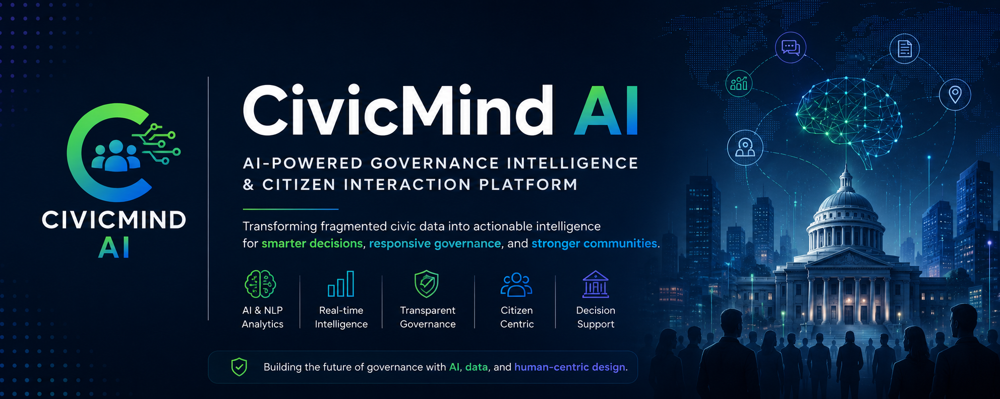

  

# CivicMind AI

### AI-Powered Governance Intelligence & Citizen Interaction Platform

CivicMind AI is a research-driven initiative exploring how Artificial Intelligence can transform governance systems into intelligent, citizen-centric decision support ecosystems.

The project proposes a unified framework that integrates citizen complaints, governance records, public datasets, social media signals, and news intelligence into actionable governance insights.

---

## Project Status

Research & Architecture Phase

CivicMind AI is currently under active research and conceptual development.

This repository serves as the public documentation hub for the project's architecture, vision, research foundation, and future development roadmap.

---

## Problem Statement

Modern governance systems face several critical challenges:

- Fragmented civic information channels
- Delayed grievance resolution
- Limited real-time visibility
- Poor analytical capabilities
- Low citizen engagement
- Lack of intelligent decision support

These limitations often prevent governments and institutions from responding effectively to emerging civic issues.

---

## Vision

To build an AI-powered governance intelligence platform capable of helping public institutions:

- Understand citizen needs
- Prioritize issues intelligently
- Improve service delivery
- Enhance transparency
- Support evidence-based decision making
- Strengthen citizen trust

---

## Core Research Areas

- Artificial Intelligence
- Governance Technology (GovTech)
- Civic Intelligence
- Natural Language Processing
- Sentiment Analysis
- Decision Intelligence
- Public Administration Systems
- Human-AI Collaboration

---

## Conceptual Architecture

CivicMind AI follows a five-layer intelligence architecture:

### Layer 1 — Data Ingestion

- Citizen Complaints
- Governance Records
- Public Datasets
- Social Media Signals
- News Intelligence

### Layer 2 — AI Processing

- NLP
- Sentiment Analysis
- Complaint Classification
- Entity Recognition

### Layer 3 — Analytics Engine

- Trend Detection
- Issue Clustering
- Predictive Analytics
- Anomaly Detection

### Layer 4 — Governance Intelligence

- Administrative Dashboards
- Issue Prioritization
- Real-Time Alerts
- Decision Support

### Layer 5 — Citizen Interaction

- Complaint Tracking
- AI Assistance
- Status Notifications
- Feedback Systems

---

## Proposed Technology Stack

### Backend

- Python
- FastAPI

### Artificial Intelligence

- Hugging Face Transformers
- Scikit-Learn

### Database

- PostgreSQL

### Search & Retrieval

- FAISS

### Messaging

- Apache Kafka

### Caching

- Redis

### Frontend

- React

### Infrastructure

- Docker
- Kubernetes

---

## Repository Documentation

| Document | Description |
|-----------|------------|
| vision.md | Project vision and mission |
| architecture.md | System architecture |
| roadmap.md | Development roadmap |
| research.md | Research foundation |
| technology-stack.md | Technical architecture |

---

## Development Roadmap

### Phase 1

Research & Architecture

### Phase 2

Prototype Development

### Phase 3

AI Intelligence Layer

### Phase 4

Citizen Experience Platform

### Phase 5

Smart Governance Expansion

---

## Research Publication

Title:

CivicMind AI: A Conceptual Framework for AI-Powered Governance Intelligence and Citizen Interaction Systems

Author:

Vishwajeet Nande

Year:

2025

---

## Future Directions

- Multilingual AI
- Explainable AI (XAI)
- Federated Learning
- Smart City Integration
- Predictive Governance
- Civic Knowledge Graphs
- Multi-Agent Governance Systems

---

## Author

Vishwajeet Nande

Founder, Inovexia AI Technologies

Research Interests:

Artificial Intelligence • Civic Intelligence • GovTech • Intelligent Systems • Human-AI Collaboration

---

## Disclaimer

CivicMind AI is currently a conceptual research initiative.

The system described within this repository is under active research and development and should not be interpreted as a production-ready governance platform.
